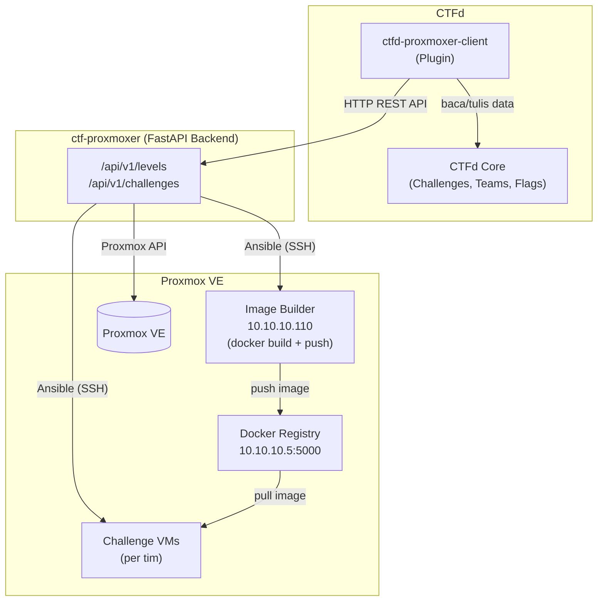

# CTF Proxmoxer Platform

Backend service yang digunakan untuk mengelola challenge CTF berbasis Virtual Machine dengan Proxmox VE. Bekerja dengan plugin CTFd [CTFd-proxmoxer-client](https://github.com/penicili/ctfd-proxmoxer-client) 


## Arsitektur



---

## Stack

- **Backend**: Python, FastAPI
- **Database**: SQLite (via SQLAlchemy)
- **Virtualisasi**: Proxmox VE (`proxmoxer`)
- **Otomasi**: Ansible (`ansible-runner`)
- **Container**: Docker, Docker Registry (`registry:2`)

---

## Instalasi

```bash
git clone https://github.com/penicili/ctf-proxmoxer.git
cd ctf-proxmoxer

python -m venv .venv
source .venv/bin/activate  # Linux/Mac
# .venv\Scripts\activate   # Windows

pip install -r requirements.txt
cp .env.example .env       # isi sesuai environment
uvicorn app:app --host 0.0.0.0 --port 8000 --reload
```

---

## Setup Infrastruktur yang Diperlukan

Sebelum backend dapat digunakan, pastikan komponen berikut sudah disiapkan di Proxmox VE:

| Komponen | Tipe | IP | Fungsi |
|---|---|---|---|
| Base Template VM | QEMU Template | — | Sumber clone untuk semua challenge VM |
| Docker Registry | LXC | 10.10.10.5 | Penyimpanan Docker image challenge |
| Image Builder | QEMU VM | 10.10.10.110 | Build dan push Docker image challenge |

Semua komponen beroperasi di jaringan internal `vmbr1` (`10.10.10.0/24`).

---

## Panduan Membuat Challenge

Challenge dibuat sebagai Git repository yang berisi aplikasi web vulnerable. Backend akan otomatis build, push, dan deploy challenge ke VM peserta.

### Struktur Repository

```
challenge-repo/
├── Dockerfile            # build image aplikasi challenge
├── docker-compose.yml    # wajib ada
├── public-images.txt     # opsional, list image publik yang dibutuhkan
└── app/
    └── ...
```

### 1. Dockerfile

Build image aplikasi challenge. Flag di-inject via environment variable `FLAG`.

```dockerfile
FROM python:3.11-slim
WORKDIR /app
COPY requirements.txt .
RUN pip install -r requirements.txt
COPY . .
CMD ["python", "app.py"]
```

Di dalam aplikasi, baca flag dari environment:
```python
import os
FLAG = os.environ.get("FLAG", "CTF{placeholder}")
```

### 2. docker-compose.yml

Wajib menggunakan environment variable `REGISTRY_HOST`, `IMAGE_TAG`, dan `FLAG` yang di-inject oleh sistem saat deploy.

**Single service:**
```yaml
services:
  app:
    image: ${REGISTRY_HOST}/${IMAGE_TAG}:latest
    ports:
      - "80:5000"
    environment:
      - FLAG=${FLAG}
```

**Multi service (contoh dengan MySQL):**
```yaml
services:
  app:
    image: ${REGISTRY_HOST}/${IMAGE_TAG}:latest
    ports:
      - "80:5000"
    environment:
      - FLAG=${FLAG}
      - DB_HOST=db
    depends_on:
      - db
  db:
    image: ${REGISTRY_HOST}/mysql:8
    environment:
      - MYSQL_ROOT_PASSWORD=root
      - MYSQL_DATABASE=challenge
```

### 3. public-images.txt (opsional)

Jika challenge butuh image publik (MySQL, Redis, dll), daftarkan di file ini. Sistem akan mirror image tersebut ke registry internal saat prepare sehingga deployment tidak bergantung pada internet.

```
mysql:8
redis:7-alpine
```

Image publik di `docker-compose.yml` harus ditulis dengan prefix `${REGISTRY_HOST}/` agar di-pull dari registry internal, bukan Docker Hub.

---

## Alur Sistem

### Prepare Level

Admin memicu prepare → backend menjalankan Ansible di Image Builder:
1. `git clone` repositori challenge
2. `docker build` image aplikasi
3. `docker push` ke registry internal (`10.10.10.5:5000`)
4. Mirror image publik dari `public-images.txt` ke registry (jika ada)
5. `level.template_url` diset ke image tag (`level-{id}`)

### Deploy Challenge

Admin deploy challenge untuk tim → backend:
1. Clone base template VM di Proxmox
2. Tunggu VM boot + cloud-init (~30 detik)
3. Setup port forwarding iptables di PVE host
4. Ansible SSH ke VM (via ProxyJump melalui PVE):
   - `git clone` repo challenge (untuk `docker-compose.yml`)
   - Tulis `.env` berisi `FLAG`, `REGISTRY_HOST`, `IMAGE_TAG`
   - `docker compose up -d --pull always`
5. Status challenge → `RUNNING`
6. Buat entri challenge + flag di CTFd via API

### Terminate Challenge

Admin terminate → backend:
1. Jalankan `post_challenge.yml` (cleanup di VM)
2. Hapus iptables rules port forwarding
3. Stop VM di Proxmox

---

## Environment Variables

Lihat `.env.example` untuk daftar lengkap. Variable penting:

| Variable | Keterangan |
|---|---|
| `PROXMOX_HOST` | IP Proxmox VE |
| `TEMPLATE_VMID` | VMID base template VM |
| `REGISTRY_HOST` | Host:port Docker Registry internal |
| `CI_RUNNER_IP` | IP VM Image Builder |
| `CTFD_URL` | URL CTFd instance |
| `CTFD_API_TOKEN` | API token CTFd untuk finalize challenge |
| `SSH_KEY_PATH` | Path SSH key untuk akses PVE dan VM |
| `VM_SSH_USERNAME` | Username cloud-init di VM challenge |
